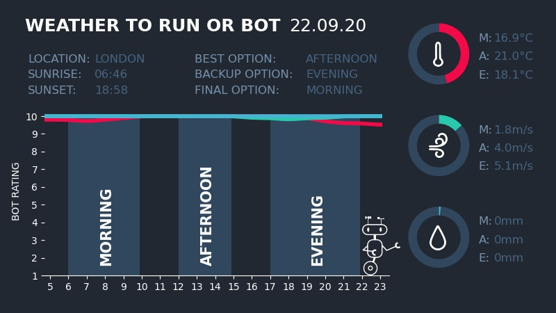
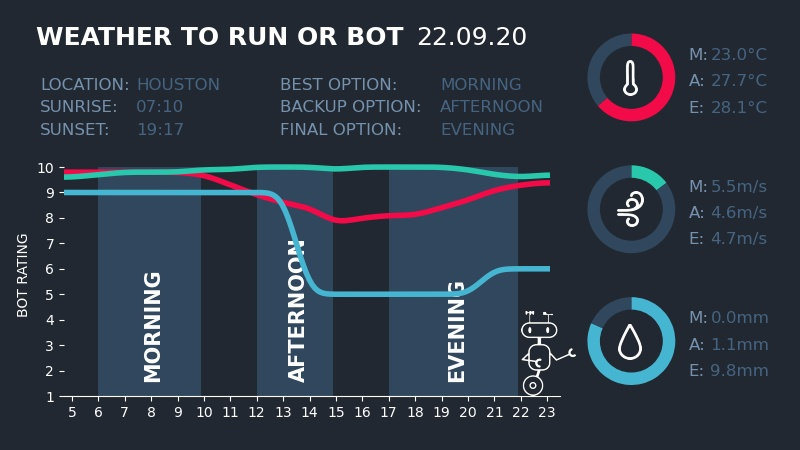

# Weather Twitter Bot For London Runners

Twitter account: [@weather_to_run](https://twitter.com/weather_to_run)

Using data from OpenWeather, this simple Twitter bot scores the next day's weather forecast (based 
on a judgement of the best conditions for running) and informs the bot's Twitter followers what time 
of the day is best to go out.

The format of these tweets are: text status with the best time of the day for running along with a 
"dashboard" image with additional information of the next day's weather.

#### Example Tweet

Status Update:

"Hello, world! All good options but in first place is afternoon, followed by morning and then evening 
(but honestly its up to you). Easy one that"

Media:

## Automation
The following is a description of the automated processes performed by the Twitter bot.

### Daily Tweet
Tweets when it thinks the best time to run is tomorrow. These tweets are scheduled for at 8pm London time 
and follow the format outlined above.

### Auto-Reply
_Not yet implemented_

Automatically replies to Twitter users that @ mentions the account to discover what the bot thinks the best
time to run in their location is. The replies must follow these formatting rules (outlined in the bot's bio):
- Be an @ mention to the [@weather_to_run](https://twitter.com/weather_to_run) account
- Use the hashtag #whataboutus
- Contain their location information, either as...
    - The english name and spelling of the nearest major city
    - Or, latitude and logitude coordinates
    
An example reply and response by the Twitter bot would be:

Reply: "@weather_to_run #whataboutus Houston"

Bot response: "\[Incoming Alert\] The morning is best for a run, that's my best guess... I say go for it"

### Follow Back
_Not yet implemented_

## Behind the Scenes

### Day Weather Object

### Tweet Generator

### Heroku Deployment