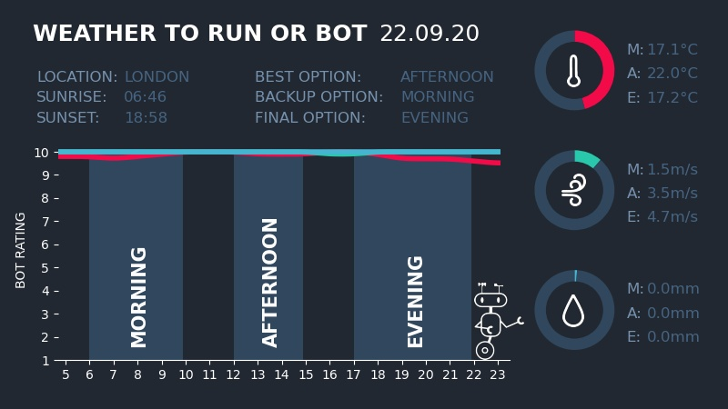

# Weather Twitter Bot For London Runners

Twitter account: [@weather_to_run](https://twitter.com/weather_to_run)

Using data from OpenWeather, this simple Twitter bot scores the next day's weather forecast (based 
on a judgement of the best conditions for running) and informs the bot's Twitter followers what time 
of the day is best to go out.

The format of these tweets are: text status with the best time of the day for running along with a 
"dashboard" image with additional information of the next day's weather.

### Example Tweet

Status Update:

"Hello, world! All good options but in first place is afternoon, followed by morning and then evening 
(but honestly its up to you). Easy one that"

Media:

## Day Weather Object

## Tweet Generator