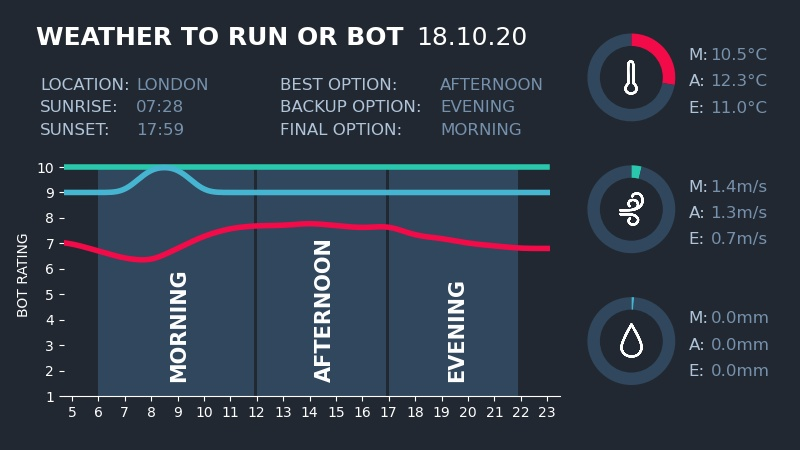
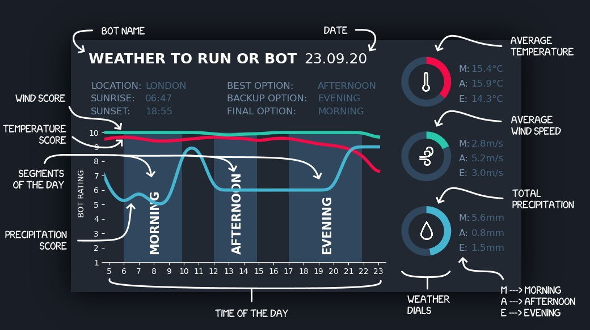
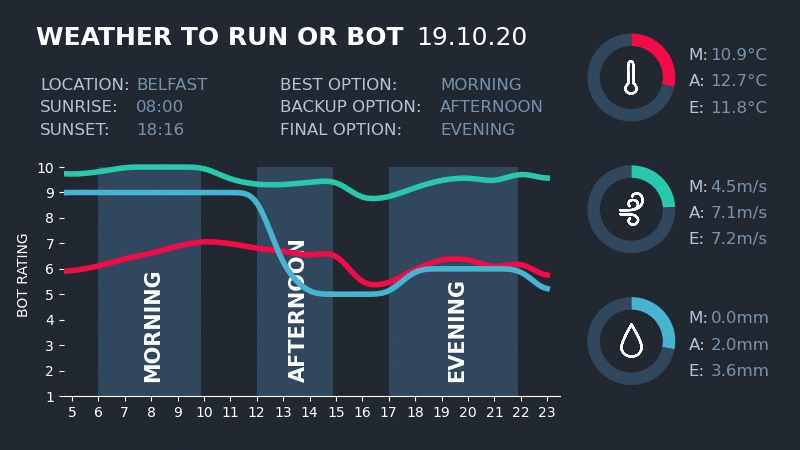

# Weather Twitter Bot For London Runners

Twitter account: [@weather_to_run](https://twitter.com/weather_to_run)

Using data from OpenWeather, this simple Twitter bot scores the next day's weather forecast (based 
on a judgement of the best conditions for running) and informs the bot's Twitter followers what time 
of the day is best to go out.

#### Example Tweet

Status Update:

"I got morning, afternoon and evening. In that order."

Media:

## Automation
The following is a description of the automated processes performed by the Twitter bot.

### Daily Tweet
Tweets when it thinks the best time to run is tomorrow. These tweets are scheduled to be posted at 10pm (London time) 
and follow the format outlined above.

Each day is split up into segments, which by default are: morning, afternoon and evening. The aim of the daily tweet 
is to rank these segments in running condition order. The time periods for each segment are set assuming the bot's
followers work typical office hours and are therefore free to run outside of those hours. The segment time periods also
vary depending on the day of the week as follows:

|           | Weekday     | Weekend     |
|-----------|-------------|-------------|
| Morning   | 06:00 - 10:00 | 06:00 - 12:00 |
| Afternoon | 12:00 - 14:00 | 12:00 - 17:00 |
| Evening   | 17:00 - 21:00 | 17:00 - 21:00 |

### Auto-Reply

Automatically replies to Twitter users that @ mentions the account to discover what the bot thinks the best
time to run in their location is. The replies must follow these formatting rules (outlined in the bot's bio):
- Be an @ mention to the [@weather_to_run](https://twitter.com/weather_to_run) account
- Use the hashtag #myweather
- Contain their location information as the english name and spelling of the nearest major city. The city name can be
anywhere in the body of the tweet text. For example "[@weather_to_run](https://twitter.com/weather_to_run) #myweather
can you tell me the weather in the great city of Manchester? Thanksss" will pick out the city name Manchester.
    
An example reply and response by the Twitter bot would be:

Reply: "[@weather_to_run](https://twitter.com/weather_to_run) #myweather Houston"

Bot response: "\[Incoming Alert\] The morning is best for a run, that's my best guess... I say go for it"

### Follow Back

Automatically follows anyone who follows the [@weather_to_run](https://twitter.com/weather_to_run) account.

## Behind the Scenes

### Day Weather Object

Encapsulation of OpenWeatherMap's One Call API response, adding model classes for convenient use and functionality. 

The One Call API response returns weather data for a given geographic location. The main information used in this model
are the:
- Hourly forecast for 48 hours
- Daily forecast for 7 days

The call provides data for a number of weather parameters - for more information, see
[Open Call API documentation](https://openweathermap.org/api/one-call-api). However, only weather parameters that are
most useful to assess the best running conditions are incorporated into the model. These are:
- Temperature
- Feels like temperature
- Wind speed
- Weather condition code
- Precipitation probability
- Precipitation volume

Encapsulation of the API response allows for more convenient handling of hours and days, as well as the addition of
any arbitrary period of the time (morning, afternoon and evening) with the same interface, attributes and methods.

A TimeElement is the "base" class. Any portion of time is a form of TimeElement and has all of the weather parameters
outlined above, along with their associated scores. Since an hour is considered the smallest unit of time
in this model, it directly inherits from TimeElement and is described in the concrete class Hour.

In order to provide a common interface, the class TimePeriod outlines spans of time like days and segments of the day.
The TimePeriod class inherits from TimeElement and is composed of a number of Hour objects. 
This class also has methods for aggregation the weather conditions and scores over its time period.
Concrete classes for DaySegment and Day inherit from TimePeriod and add the final level of specificity for attributes 
and methods of those periods of time. For example, the Day class uniquely has the attributes sunset and sunrise
time.

TimePeriods also have the attribute "alert level". This is a discretisation and simplified categorisation of the 
time-varying scores for each weather parameter. These three levels are:
- 🟢 Green - good weather
- 🟡 Amber - not the best but manageable weather
- 🔴 Red - bad weather

### Tweet Generator

Very simple text summary using the outputs of weather scoring, "alert level" assessment and day segment ranking.
Tweets are formed from pre-written components/templates stored in a PostgreSQL database provided by Heroku.

Each tweet status has three possible components:
- Introduction
- Forecast
- Outro/Sign-off

Note: Introductions and outro's are not always a component of the tweet. They have some <100% percentage chance of 
inclusion, defined in the configurations. The purpose of this behaviour is to provide additional randomness.

Each tweet component is further subdivided by it's "tone". These tones mirror the alert levels outlined above. For 
example, pre-written introduction components could be "Hey there", "Tricky one this" or "Eeeeek..." based off the alert
level for the day's weather being green, amber or red, respectively.

Forecast text templates (also classified by tone) have placeholder words which are substituted for by the day segment
names ("morning", "afternoon", "evening") when the tweet is composed. For example, a forecast component, with a tone of 
"green" and number of selections as 2, is "According to my sources, the weather is looking good for A(N) NOUN or NOUN 
run." The placeholder words here are "NOUN" and "A(N)". The number of selections property is used when there are 
multiple day segments with the same alert level.

In addition to storing the tweet components, the PostgreSQL database is used to track the number of times each component
has been used and the tweets that they form. This is to provide a greater sense of randomness to the tweets. By
tracking which components have and have not been used, subsequent tweets can only be formed from components which
are yet to be used. This makes the chance that a tweet, or any of its components, cropping up in consecutive tweets 
nearly impossible. Once all tweet components of a particularly type have been used, the "used" column resets all to
False and all of those components are free to be used again.

##### Future Development
In the future, it would be nice to experiment with natural-language generation (NLG) to form the bot's tweet messages.

### Heroku Deployment

This twitter bot is deployed on Heroku as a continuously running worker dyno. The periodic actions/processes performed
by this bot are:
- Check for @ mentions to the bot's account every 15 seconds... and auto-reply if to the new mentions if found
- Check for new followers to the bot's account every 10 minutes... and follow back new followers if found
- Post daily tweet at 10pm bot local time

The deployment method is "automatic deploys" via the master branch of this GitHub repository.
